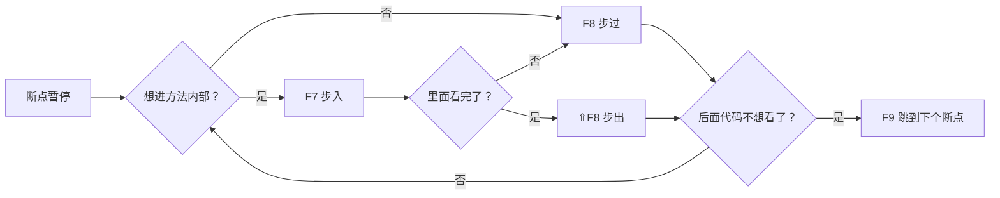

# IntelliJ IDEA 调试快捷键详解

---

## 一、核心理念：调试时你在"逐行看代码怎么跑"

当你打了断点（红色圆点）启动调试后，程序跑到断点处会**暂停**。此时你需要手动控制代码**一行一行地走**，观察变量值的变化，从而定位 Bug。

IDEA 提供了几个控制"下一步怎么走"的按钮，对应不同快捷键。

---

## 二、核心调试快捷键（必懂）

| 快捷键 | 中文名 | 英文名 | 通俗理解 |
|--------|--------|--------|---------|
| **F8** | 步过 / 单步跳过 | Step Over | **执行当前行，不进入方法内部**。把方法调用当成"一步"直接跨过去 |
| **F7** | 步入 / 单步进入 | Step Into | **钻进当前行的方法内部**，看看这个方法到底干了什么 |
| **⇧F8** | 步出 / 单步跳出 | Step Out | **从当前方法里跳出来**，回到调用它的上一级方法 |
| **⌥⇧F7** | 强制步入 | Force Step Into | 有些方法（如 JDK 源码）普通 F7 进不去，用这个**强行钻进去** |
| **F9** | 恢复执行 | Resume | **直接跑到下一个断点**（或跑完整个程序），不想逐行看时使用 |
| **⌥F9** | 运行到光标 | Run to Cursor | **让程序跑到光标所在行再停下**，相当于临时断点 |

> macOS 与 Windows 键位一致，`⇧` = Shift，`⌥` = Alt，`⌘` = Ctrl（仅在部分组合键中）。

---

## 三、场景化理解（三个 F 怎么配合）

假设你现在停在断点处，下一行代码是：

```java
String result = userService.getUserName(userId);  // ← 程序停在这一行
System.out.println("结果是：" + result);            // 下一行
```

### 按 F8 — Step Over（跨过去）

```
程序直接跳到 System.out.println 那一行
getUserName() 方法执行完了，但你不知道它里面发生了什么
```

> **适用场景**：你确定 `getUserName()` 没问题，不想浪费时间看它内部实现。

### 按 F7 — Step Into（钻进去）

```
程序跳进 getUserName() 方法的第一行代码
你可以接着用 F8 一行一行看这个方法内部的执行逻辑
```

> **适用场景**：你怀疑 `getUserName()` 有 Bug，需要进去排查。

### 按 ⇧F8 — Step Out（跳出来）

```
当你在 getUserName() 内部已经看完了
按 Shift+F8，程序直接跳出，回到调用处的下一行（System.out.println）
```

> **适用场景**：方法内部已经确认没问题了，不想傻傻走到方法末尾。

---

## 四、一张图串起调试流程



---

## 五、辅助调试快捷键

| 快捷键 | 作用 | 说明 |
|--------|------|------|
| **⌘F8** / **Ctrl+F8** | 切换断点 | 在光标所在行**打上/取消断点** |
| **⌘⇧F8** / **Ctrl+Shift+F8** | 查看所有断点 | 打开断点管理窗口，可批量删除、设置条件 |
| **F2** | 跳到下一个错误 | 快速定位下一个报错位置 |
| **⌥⌘R** / **Alt+Shift+F9** | 以 Debug 模式运行 | 等同于点绿色小虫按钮 |
| **⌃R** / **Shift+F10** | 以 Run 模式运行 | 正常运行，不走调试 |
| **⌘⇧V** / **Ctrl+Shift+V** | Evaluate Expression | 弹出表达式求值窗口，**手动执行一段代码看结果**，调试利器 |

---

## 六、高级技巧

### 条件断点

在断点上右键 → 输入条件表达式，**只有条件成立才会停下**：

```java
// 比如循环 1000 次，只想在 userId == 888 时停
userId == 888
```

### 异常断点

不需要手动打断点，程序**在任何地方抛出指定异常时自动暂停**：

> `Run → View Breakpoints → Java Exception Breakpoints → 添加 NullPointerException`

### 变量标记

调试时对变量右键 → `Mark Object`，给对象打个标签，之后在整个调试过程都能通过标签追踪同一个对象。

---

## 七、速记口诀

```
F8 跨过去（看结果不看过程）
F7 钻进去（看过程找 Bug）
Shift+F8 跳出来（看完了赶紧撤）
F9 接着跑（直奔下个断点）
```
